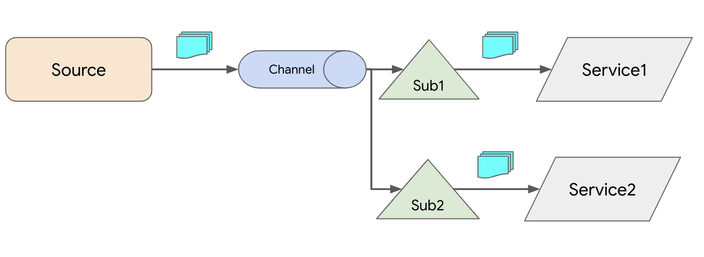

# Complex Delivery

In [Simple Delivery](simpledelivery.md) example, we see how an Event Source can send a message directly to a Service. This works in 1-1 case but if you need to fan out from an Event Source to multiple Services, you need to use Channels and Subscriptions.



## Channel

[Channel](https://knative.dev/docs/eventing/channels/) is the persistence and forwarding layer. Knative supports a number of [Channels](https://knative.dev/docs/eventing/channels/channels-crds/) with different persistence guarantees.

For this example, we'll use `InMemoryChannel`. It's not meant for production but ok for testing.

Define [channel.yaml](../eventing/complex/channel.yaml).

Create the channel:

```bash
kubectl apply -f channel.yaml

inmemorychannel.messaging.knative.dev/channel created
```

## Source

Define [source.yaml](../eventing/complex/source.yaml).

It sends a message every minute to an event sink, in this case, an `InMemoryChannel`.

Create the source:

```bash
kubectl apply -f source.yaml

cronjobsource.sources.eventing.knative.dev/source created
```

## Services

Create [service1.yaml](../eventing/complex/service1.yaml).

Create another [service2.yaml](../eventing/complex/service2.yaml) for the second service.

These are Knative Services that simply log out received messages.

Create the services:

```bash
kubectl apply -f service1.yaml -f service2.yaml

service.serving.knative.dev/service1 created
service.serving.knative.dev/service2 created
```

## Subscription

Connect services to the channel with subscriptions.

Define [subscription1.yaml](../eventing/complex/subscription1.yaml).

Define another [subscription2.yaml](../eventing/complex/subscription2.yaml) for the second subscription.

Create the subscriptions:

```bash
kubectl apply -f subscription1.yaml -f subscription2.yaml

subscription.messaging.knative.dev/subscription1 created
subscription.messaging.knative.dev/subscription2 created
```

## Verify

Check the running pods:

```bash
kubectl get pods

NAME                                                              READY STATUS    RESTARTS   AGE
cronjobsource-source-3c465b71-4bbe-4611-a816-a73a75cf8681-66ps5   1/1     Running   0          2m54s
service1-x25xg-deployment-55f957448-rtljx                         2/2     Running   0          2m57s
service2-5tpzm-deployment-58c6bcb455-vxdg                         2/2     Running   0          2m57s
```

Get the container name:

```bash
kubectl get pods
```

Check the logs of the services. You should see messages from the CronJobSource in each service:

```bash

kubectl logs {container-name} -c user-container

[2020-10-12 04:11:02 +0000] [1] [INFO] Starting gunicorn 20.0.4
[2020-10-12 04:11:02 +0000] [1] [INFO] Listening at: http://0.0.0.0:8080 (1)
[2020-10-12 04:11:02 +0000] [1] [INFO] Using worker: threads
[2020-10-12 04:11:02 +0000] [8] [INFO] Booting worker with pid: 8
[2020-10-12 04:11:02 +0000] [8] [INFO] Event Display starting
[2020-10-12 04:11:03 +0000] [8] [INFO] Event Display received event: {"message":"Hello world from ping!"}
[2020-10-12 04:12:00 +0000] [8] [INFO] Event Display received event: {"message":"Hello world from ping!"}
```
